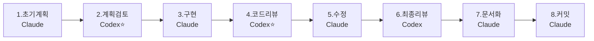

# 🔄 Claude-Codex 협업 워크플로우 가이드

> 최종 확정: 2025-08-20  
> 작성자: Claude & User  
> 목적: 모든 개발 작업의 표준 프로세스 정의

## 📋 8단계 표준 워크플로우



## 🎯 각 단계별 상세 가이드

### Step 1: 초기 계획 수립 (Claude)
**목적**: 요구사항을 이해하고 초기 설계안 작성

**체크리스트**:
- [ ] 요구사항 분석 및 정제
- [ ] 영향 범위 파악 (파일, API, DB)
- [ ] 초기 설계안 작성
- [ ] 리스크 사전 식별
- [ ] 작업 우선순위 결정

**산출물**:
```markdown
## 초기 계획
### 요구사항
- 

### 영향 범위
- 파일: 
- API: 
- DB: 

### 구현 방안
1. 
2. 

### 예상 리스크
- 
```

---

### Step 2: 계획 검토 (Codex) ⭐
**목적**: 기술적 타당성 검증 및 개선안 제시

**Codex 호출 예시**:
```python
codex(
    prompt="""
    다음 계획을 검토해주세요:
    [Claude의 초기 계획 붙여넣기]
    
    검토 항목:
    1. 기술적 타당성
    2. 프로젝트 규약 준수
    3. 성능/보안 고려사항
    4. 더 나은 접근법
    """,
    sandbox="workspace-write",
    approval-policy="never"  # ⚠️ 중요: 이 설정이 없으면 응답이 없을 수 있음!
)
```

**⚠️ 중요: approval-policy 설정**
- `approval-policy="never"` 반드시 추가할 것
- 이 설정이 없으면 Codex가 응답하지 않는 경우 발생
- 파일 읽기/분석 작업에는 안전한 설정임

**체크리스트**:
- [ ] 기술적 실현 가능성 검증
- [ ] 프로젝트 규약 준수 확인
- [ ] 성능 영향 분석
- [ ] 보안 취약점 체크
- [ ] 대안 제시

---

### Step 3: 최종 계획 + 코드 구현 (Claude)
**목적**: Codex 피드백 반영하여 실제 구현

**체크리스트**:
- [ ] Codex 피드백 모두 반영
- [ ] 코드 작성 (API, 서비스, 스키마)
- [ ] 테스트 코드 작성
- [ ] 에러 처리 구현
- [ ] 로깅 추가

**구현 규약**:
- SQLAlchemy: `result = await db.execute()` → `result.scalars().all()` (await 금지)
- 예외처리: `APIException` 사용 (HTTPException 금지)
- 라우트: 하이픈 사용, 후행 슬래시 포함 (`/api/v1/driver-dispatch/`)
- 스키마: Pydantic v2 `ConfigDict` 사용

---

### Step 4: 코드 리뷰 (Codex) ⭐
**목적**: 코드 품질 검증 및 버그 발견

**Codex 호출 예시**:
```python
# 새 세션으로 시작 (세션 유지가 어려운 경우)
codex(
    prompt="""
    작성된 코드를 리뷰해주세요:
    
    파일 목록:
    - app/api/v1/...
    - app/services/...
    - tests/...
    
    리뷰 포인트:
    1. 코드 품질 및 가독성
    2. 버그/취약점
    3. 성능 이슈
    4. 테스트 커버리지
    5. 프로젝트 규약 준수
    """,
    sandbox="workspace-write",
    approval-policy="never"  # ⚠️ 필수!
)

# 또는 기존 세션 이어서 (sessionId가 있는 경우)
codex-reply(
    sessionId="...",
    prompt="위 코드 리뷰 부탁합니다"
)
```

**체크리스트**:
- [ ] 코드 스타일 및 가독성
- [ ] 잠재적 버그 식별
- [ ] 성능 병목 지점
- [ ] 보안 취약점
- [ ] 테스트 충분성

---

### Step 5: 코드 수정 (Claude)
**목적**: 리뷰 피드백 즉시 반영

**체크리스트**:
- [ ] 모든 리뷰 사항 반영
- [ ] 테스트 업데이트
- [ ] 리팩토링 적용
- [ ] 주석/문서 보강

---

### Step 6: 최종 리뷰 (Codex)
**목적**: CI/CD 준비 상태 확인

**체크리스트**:
- [ ] `python scripts/route_lint.py` 통과
- [ ] `python scripts/pagination_lint.py` 통과
- [ ] `ruff format .` 실행
- [ ] `ruff check . --fix` 실행
- [ ] `docker exec wastelite-web-1 pytest tests/` 통과
- [ ] 타입체크 `pyright` 통과

---

### Step 7: 문서화 (Claude)
**목적**: 변경사항 문서화 및 프론트엔드 동기화

**체크리스트**:
- [ ] OpenAPI 재생성
  ```bash
  docker exec wastelite-web-1 bash -c "cd /app && PYTHONPATH=/app python scripts/generate_openapi.py"
  ```
- [ ] WORKLOG.md 업데이트
  ```
  YYYY-MM-DD HH:MM | Claude | 타입 | 요약 | 파일1,파일2
  ```
- [ ] Release Notes 작성 (Breaking Changes 있을 경우)
- [ ] TODO.md 업데이트

---

### Step 8: Git 커밋 (Claude)
**목적**: 변경사항 커밋 및 PR 생성

**체크리스트**:
- [ ] 커밋 메시지 작성 (`type(scope): 한글 요약`)
- [ ] PR 템플릿 작성
- [ ] CI 게이트 통과 확인
- [ ] 프론트엔드 영향 체크

**커밋 메시지 예시**:
```bash
git commit -m "feat(api): 배차 상태 관리 개선

- 9단계를 5단계로 단순화
- 마이그레이션 스크립트 추가
- API 호환성 유지

🤖 Generated with Claude Code & Codex

Co-Authored-By: Claude <noreply@anthropic.com>"
```

---

## 💡 워크플로우 사용 방법

### 시작하기
```markdown
사용자: "새로운 기능 개발 시작, 워크플로우로 진행"
Claude: [Step 1] 초기 계획을 수립하겠습니다...
```

### Codex 호출
```markdown
사용자: "Codex로 계획 검토"
또는
사용자: "Step 2 진행"
```

### 진행 상태 확인
```markdown
사용자: "현재 워크플로우 상태는?"
Claude: 현재 Step 3 진행 중입니다. [상세 내용]
```

---

## 📊 효율성 메트릭

| 단계 | 담당 | 평균 소요시간 | 중요도 |
|------|------|-------------|--------|
| 1. 초기 계획 | Claude | 5-10분 | ⭐⭐⭐⭐ |
| 2. 계획 검토 | Codex | 5-10분 | ⭐⭐⭐⭐⭐ |
| 3. 구현 | Claude | 20-60분 | ⭐⭐⭐⭐ |
| 4. 코드 리뷰 | Codex | 10-15분 | ⭐⭐⭐⭐⭐ |
| 5. 수정 | Claude | 10-20분 | ⭐⭐⭐ |
| 6. 최종 리뷰 | Codex | 5분 | ⭐⭐⭐ |
| 7. 문서화 | Claude | 10분 | ⭐⭐⭐⭐ |
| 8. 커밋 | Claude | 5분 | ⭐⭐⭐ |

**총 예상 시간**: 1-2시간 (복잡도에 따라 변동)

---

## 🚨 주의사항

### Codex 제약사항
- 네트워크 접근 불가 (패키지 설치, 외부 API 호출 제한)
- 한 번에 최대 3개 파일 수정
- 로컬 pytest 실행 불가 (컨테이너 내부에서만)

### Claude 주의사항
- 서브에이전트 사용 비권장 (직접 작업이 더 효율적)
- 모호한 지시 금지 (구체적인 파일/라인/함수 명시)
- 테스트는 반드시 컨테이너 내부에서 실행

### 공통 규약
- 모든 응답은 한국어로 작성
- 코드 주석도 한국어 사용
- 커밋 메시지도 한국어 사용
- WORKLOG.md 필수 업데이트

---

## 📚 참고 문서
- [CLAUDE.md](./CLAUDE.md) - Claude 작업 가이드
- [AGENTS.md](./AGENTS.md) - Codex 작업 가이드
- [TODO.md](./TODO.md) - 현재 작업 목록
- [docs/wastelite_backend_techdoc_master.md](./docs/wastelite_backend_techdoc_master.md) - 기술 명세서

---

## 🔄 버전 이력
- 2025-08-20: 초기 버전 작성 (8단계 워크플로우 확정)

---

*이 문서는 Claude와 Codex의 협업 표준을 정의합니다. 모든 개발 작업은 이 워크플로우를 따라야 합니다.*